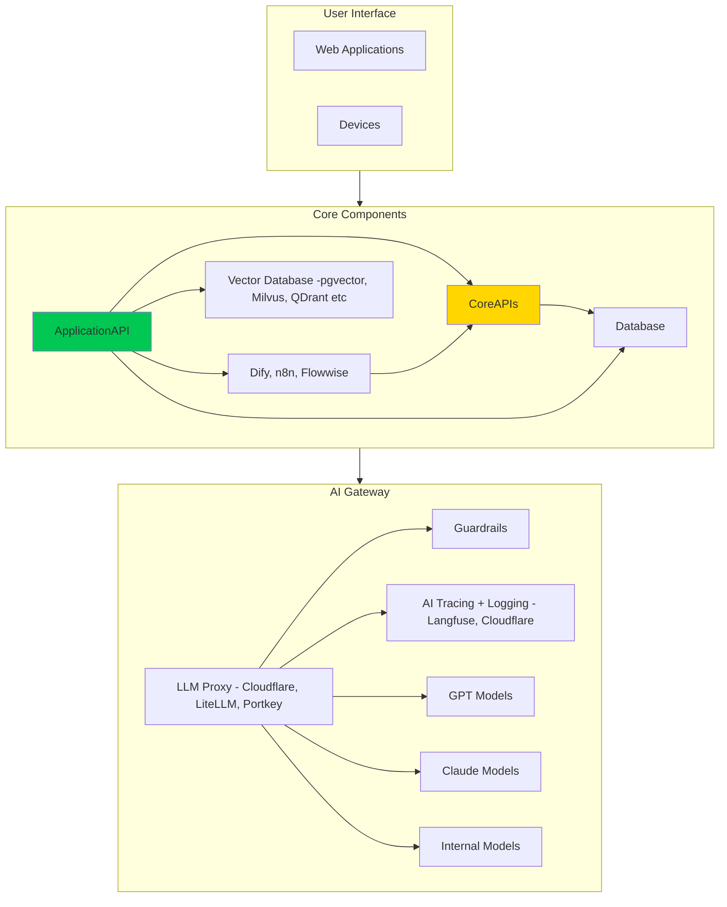
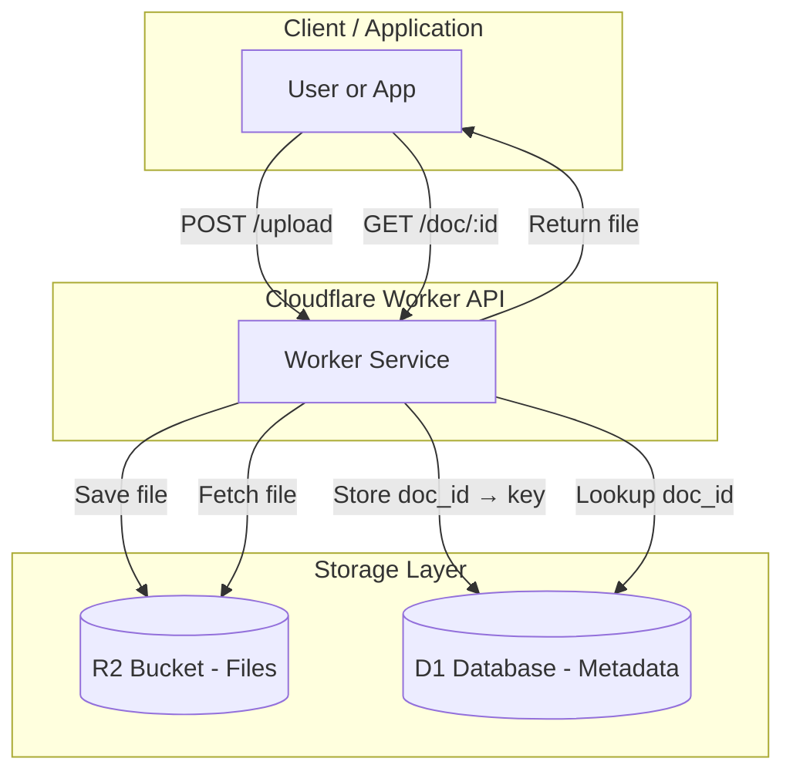
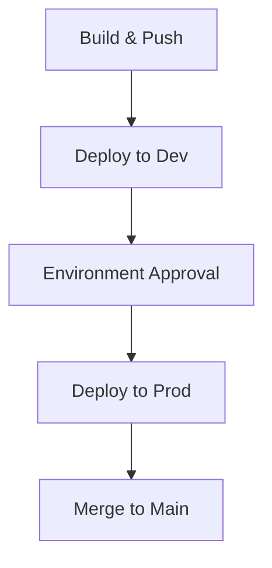
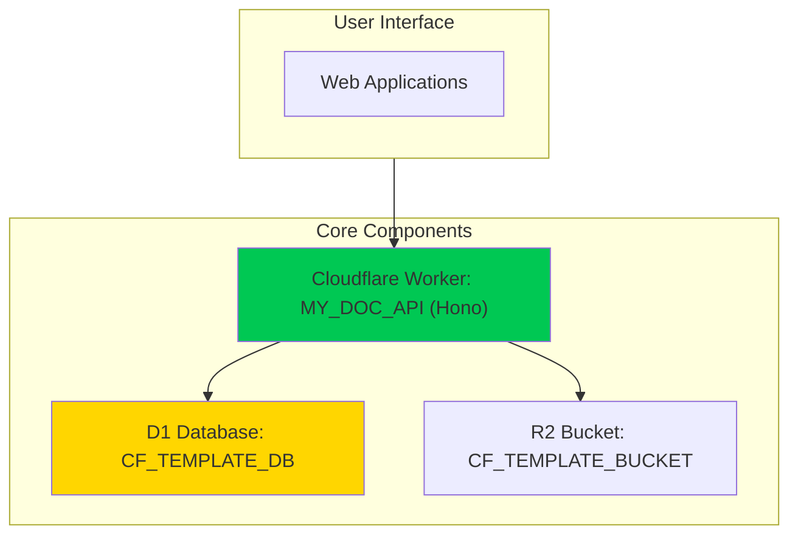
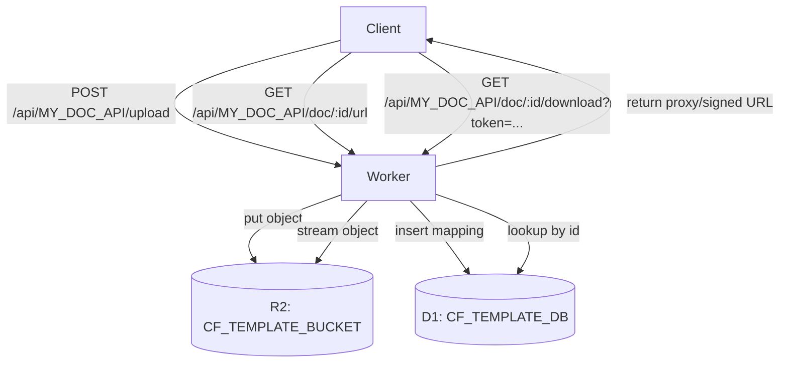

# HumanizeIQ – MY_DOC_API (Cloudflare Worker) Design

This document defines the design for an API implemented as a Cloudflare Worker that:

- Uploads file contents to an R2 bucket under a specified folder (POST)
- Returns a retrievable document URL (signed download URL or proxy URL) for a document ID (GET)

The API conforms to HumanizeIQ standards for design, auth, routing, and review.

---

## 1️⃣ Customized System Blueprint



- ✅ Built: `ApplicationAPI` (this Worker)
- 🔶 Used: `CoreAPIs` (for future integrations or metadata services)

---

## 2️⃣ High-Level App Flow


## 3️⃣ Component Reference List

- **Built Components**
  - `MY_DOC_API` (this repository). Reverse link: add this design in `design/my_doc_api/design.md`.

- **Used Components**
  - Core APIs: Not Available (future)
  - UX: Not Available (future consumer)

---

## 4️⃣ API Overview and Standards

- **Framework/Runtime**: Cloudflare Worker (TypeScript)
- **Mount Base**: `/api/${APP_NAME}` where `APP_NAME=MY_DOC_API`
- **Mandatory Endpoints**
  - `GET /health` → returns `"OK"`
  - `GET /api-name` → returns value of `APP_NAME` env
- **Authentication**: Static API key via `x-api-key`
  - Header: `x-api-key: <KEY>`
  - POST scope: `write:documents`
  - GET scope: `read:documents`
- **Local Run**: `wrangler dev` (optionally via Docker for parity)
- **Deployment**: GitHub Actions → Cloudflare Pages/Workers deploy with approval gates

---

## 5️⃣ Endpoints

### 5.1 POST `/api/MY_DOC_API/upload`

Uploads file content to R2 under a provided folder path and indexes a `doc_id` to object key mapping in KV.

- **Auth**: `x-api-key` required
- **Content Types (choose one)**:
  - `multipart/form-data` with fields:
    - `file` (File) – required
    - `folder` (string) – required. Example: `invoices/2025/` (trailing slash optional)
    - `filename` (string) – optional override; defaults to uploaded file name
  - `application/octet-stream` body + query params `?folder=...&filename=...`
- **Behavior**
  - Normalizes folder path
  - Generates `doc_id` (UUID v4)
  - Object key format: `${folder}/${doc_id}/${filename}`
  - Stores object in `DOCS_BUCKET`
  - Persists mapping in `DOCS_INDEX` KV: `doc:${doc_id} -> { key, contentType, size, createdAt }`
- **Success 201**
```json
{
  "doc_id": "1b2c3d4e-...",
  "key": "invoices/2025/1b2c3d4e-.../invoice-001.pdf",
  "size": 204800,
  "content_type": "application/pdf"
}
```
- **Errors**
  - 400: Missing parameters
  - 401/403: Invalid API key
  - 500: Upload failure

### 5.2 GET `/api/MY_DOC_API/doc/:id/url`

Returns a retrievable URL for the document mapped to `:id`.

- **Auth**: `x-api-key` required
- **Query**:
  - `mode` (optional): `proxy` (default) or `presigned`
  - `expires` (optional): seconds for URL validity (default 600)
- **Modes**
  - `proxy`: returns a Worker-hosted signed token URL `GET /api/MY_DOC_API/doc/:id/download?token=...` that streams the object via Worker
  - `presigned`: returns an R2 S3-style presigned URL (requires R2 S3 credentials configured as secrets)
- **Success 200**
```json
{
  "doc_id": "1b2c3d4e-...",
  "url": "https://<worker-domain>/api/MY_DOC_API/doc/1b2c3d4e-.../download?token=eyJ...",
  "expires_in": 600,
  "mode": "proxy"
}
```

### 5.3 GET `/api/MY_DOC_API/doc/:id/download`

Streams the object if a valid `token` query param is presented (for `proxy` mode URLs). Token encapsulates `doc_id`, expiry, and HMAC.

---

## 6️⃣ Authentication & Authorization

- **Method**: API Key via `x-api-key`
- **Validation**: Compare header to secret `API_KEY` or allow multiple via KV `API_KEYS` list (optional)
- **Errors**: Return 401/403 with standard JSON error format

```json
{
  "error": {
    "code": "FORBIDDEN",
    "message": "Your API key is invalid or missing."
  }
}
```

---

## 7️⃣ Bindings, Environment, and Configuration

Use the following Cloudflare bindings via `wrangler.toml`.

- **R2 Bucket**
  - Binding: `DOCS_BUCKET`
  - Purpose: store uploaded files

- **KV Namespace**
  - Binding: `DOCS_INDEX`
  - Purpose: map `doc_id` → object key + metadata

- **Plain Env Vars**
  - `APP_NAME=MY_DOC_API`
  - `API_KEY=...` (primary API key)
  - `URL_SIGNING_SECRET=...` (HMAC secret for proxy tokens)

- **Optional Secrets (for presigned mode)**
  - `R2_ACCESS_KEY_ID`
  - `R2_SECRET_ACCESS_KEY`
  - `R2_ACCOUNT_ID` (or endpoint base)
  - `R2_BUCKET_REGION` (use `auto` or appropriate)

### Example `wrangler.toml`

```toml
name = "my-doc-api"
main = "src/index.ts"
compatibility_date = "2024-09-01"

[[r2_buckets]]
binding = "DOCS_BUCKET"
bucket_name = "hiq-docs"

[[kv_namespaces]]
binding = "DOCS_INDEX"
id = "<kv-namespace-id>"

[vars]
APP_NAME = "MY_DOC_API"

#[secrets]
# API_KEY, URL_SIGNING_SECRET, R2_ACCESS_KEY_ID, R2_SECRET_ACCESS_KEY, R2_ACCOUNT_ID
```

---

## 8️⃣ Worker Implementation (TypeScript)

Below is a reference implementation illustrating the core logic. Production code should include additional logging, tracing, and guardrails.

```ts
// src/index.ts
export interface Env {
  DOCS_BUCKET: R2Bucket;
  DOCS_INDEX: KVNamespace;
  APP_NAME: string;
  API_KEY: string;
  URL_SIGNING_SECRET: string;
  R2_ACCESS_KEY_ID?: string;
  R2_SECRET_ACCESS_KEY?: string;
  R2_ACCOUNT_ID?: string;
}

const JSON_HEADERS = { "content-type": "application/json" };

function json(data: unknown, init: ResponseInit = {}) {
  return new Response(JSON.stringify(data), {
    headers: { ...JSON_HEADERS, ...(init.headers || {}) },
    status: init.status || 200,
  });
}

function error(code: string, message: string, status = 400) {
  return json({ error: { code, message } }, { status });
}

function checkAuth(req: Request, env: Env) {
  const key = req.headers.get("x-api-key");
  return key && env.API_KEY && key === env.API_KEY;
}

async function readMultipart(req: Request) {
  const form = await req.formData();
  const file = form.get("file");
  const folder = String(form.get("folder") || "");
  const filename = String(form.get("filename") || (file as File | null)?.name || "file.bin");
  if (!(file instanceof File) || !folder) return { error: "MISSING" } as const;
  return { file, folder, filename } as const;
}

function normalizeFolder(folder: string) {
  return folder.replace(/^\/+/, "").replace(/\/+/g, "/").replace(/\/?$/, "");
}

function uuidv4() {
  // RFC4122 v4 using crypto.getRandomValues
  const bytes = crypto.getRandomValues(new Uint8Array(16));
  bytes[6] = (bytes[6] & 0x0f) | 0x40;
  bytes[8] = (bytes[8] & 0x3f) | 0x80;
  const toHex = (n: number) => n.toString(16).padStart(2, "0");
  const b = Array.from(bytes, toHex).join("");
  return `${b.substring(0,8)}-${b.substring(8,12)}-${b.substring(12,16)}-${b.substring(16,20)}-${b.substring(20)}`;
}

async function hmacSHA256(secret: string, data: string) {
  const key = await crypto.subtle.importKey(
    "raw",
    new TextEncoder().encode(secret),
    { name: "HMAC", hash: "SHA-256" },
    false,
    ["sign", "verify"],
  );
  const sig = await crypto.subtle.sign("HMAC", key, new TextEncoder().encode(data));
  return btoa(String.fromCharCode(...new Uint8Array(sig)));
}

function nowSec() { return Math.floor(Date.now() / 1000); }

export default {
  async fetch(req: Request, env: Env, ctx: ExecutionContext): Promise<Response> {
    const url = new URL(req.url);
    const { pathname, searchParams } = url;

    // Health and name
    if (req.method === "GET" && pathname === "/health") return new Response("OK");
    if (req.method === "GET" && pathname === "/api-name") return new Response(env.APP_NAME || "");

    // Require API key on all other routes
    if (!checkAuth(req, env)) return error("FORBIDDEN", "Your API key is invalid or missing.", 403);

    // POST /api/MY_DOC_API/upload
    if (req.method === "POST" && pathname === "/api/MY_DOC_API/upload") {
      let file: File, folder: string, filename: string;
      if (req.headers.get("content-type")?.includes("multipart/form-data")) {
        const parsed = await readMultipart(req);
        if (parsed.error === "MISSING") return error("BAD_REQUEST", "file and folder are required.", 400);
        ({ file, folder, filename } = parsed as any);
      } else {
        // octet-stream path
        const folderParam = searchParams.get("folder") || "";
        const filenameParam = searchParams.get("filename") || "file.bin";
        if (!folderParam) return error("BAD_REQUEST", "folder is required.", 400);
        const buf = await req.arrayBuffer();
        file = new File([buf], filenameParam, { type: req.headers.get("content-type") || "application/octet-stream" });
        folder = folderParam;
        filename = filenameParam;
      }

      const safeFolder = normalizeFolder(folder);
      const docId = uuidv4();
      const key = `${safeFolder}/${docId}/${filename}`;

      const putRes = await env.DOCS_BUCKET.put(key, file.stream(), {
        httpMetadata: { contentType: file.type },
      });
      if (!putRes) return error("UPLOAD_FAILED", "Failed to store object.", 500);

      const meta = {
        key,
        contentType: file.type,
        size: file.size,
        createdAt: new Date().toISOString(),
      };
      await env.DOCS_INDEX.put(`doc:${docId}`, JSON.stringify(meta), { expirationTtl: 60 * 60 * 24 * 365 });

      return json({ doc_id: docId, key, size: file.size, content_type: file.type }, { status: 201 });
    }

    // GET /api/MY_DOC_API/doc/:id/url
    const urlMatch = pathname.match(/^\/api\/MY_DOC_API\/doc\/(.+?)\/url$/);
    if (req.method === "GET" && urlMatch) {
      const docId = urlMatch[1];
      const metaStr = await env.DOCS_INDEX.get(`doc:${docId}`);
      if (!metaStr) return error("NOT_FOUND", "Document not found.", 404);
      const meta = JSON.parse(metaStr) as { key: string };

      const mode = (searchParams.get("mode") || "proxy").toLowerCase();
      const expires = Math.min(parseInt(searchParams.get("expires") || "600", 10), 3600);

      if (mode === "presigned") {
        // Optionally implement S3 presigned GET here; fall back to proxy if not configured
        if (!env.R2_ACCESS_KEY_ID || !env.R2_SECRET_ACCESS_KEY || !env.R2_ACCOUNT_ID) {
          // Not configured; fall back to proxy mode
        } else {
          // For brevity, return proxy in this snippet and document presign in notes
        }
      }

      // Proxy URL mode using HMAC token
      const exp = nowSec() + expires;
      const payload = `${docId}.${exp}`;
      const sig = await hmacSHA256(env.URL_SIGNING_SECRET, payload);
      const token = encodeURIComponent(btoa(JSON.stringify({ d: docId, e: exp, s: sig })));
      const base = `${url.origin}/api/MY_DOC_API/doc/${docId}/download`;
      return json({ doc_id: docId, url: `${base}?token=${token}`, expires_in: expires, mode: "proxy" });
    }

    // GET /api/MY_DOC_API/doc/:id/download?token=...
    const dlMatch = pathname.match(/^\/api\/MY_DOC_API\/doc\/(.+?)\/download$/);
    if (req.method === "GET" && dlMatch) {
      const token = searchParams.get("token");
      if (!token) return error("BAD_REQUEST", "Missing token.", 400);
      let parsed: any;
      try { parsed = JSON.parse(atob(token)); } catch { return error("BAD_TOKEN", "Invalid token.", 400); }
      const { d: docId, e: exp, s } = parsed || {};
      if (!docId || !exp || !s) return error("BAD_TOKEN", "Invalid token payload.", 400);
      if (nowSec() > Number(exp)) return error("EXPIRED", "Token expired.", 401);
      const expected = await hmacSHA256(env.URL_SIGNING_SECRET, `${docId}.${exp}`);
      if (expected !== s) return error("FORBIDDEN", "Invalid token signature.", 403);

      const metaStr = await env.DOCS_INDEX.get(`doc:${docId}`);
      if (!metaStr) return error("NOT_FOUND", "Document not found.", 404);
      const meta = JSON.parse(metaStr) as { key: string; contentType?: string };

      const obj = await env.DOCS_BUCKET.get(meta.key);
      if (!obj) return error("NOT_FOUND", "Object missing in storage.", 404);
      const headers = new Headers();
      if (meta.contentType) headers.set("content-type", meta.contentType);
      return new Response(obj.body, { headers });
    }

    return error("NOT_FOUND", "Route not found.", 404);
  },
};
```

### Notes on Presigned URL Mode (Optional)

- To issue an R2-compatible S3 presigned URL from a Worker, you can implement AWS SigV4 signing using Web Crypto and the R2 S3 endpoint (`https://<accountid>.r2.cloudflarestorage.com`).
- Required secrets: `R2_ACCESS_KEY_ID`, `R2_SECRET_ACCESS_KEY`, `R2_ACCOUNT_ID`.
- For simplicity, the provided snippet defaults to `proxy` mode. Enable `presigned` by adding a signer and returning the signed GET URL for the object key.

---

## 9️⃣ Error Handling

- **Format**: All errors use `{ error: { code, message } }`
- **Common Codes**
  - `BAD_REQUEST`, `FORBIDDEN`, `NOT_FOUND`, `UPLOAD_FAILED`, `EXPIRED`, `BAD_TOKEN`
- **Logging**: Add console logs with request IDs for observability. Integrate with Langfuse/Cloudflare logs in production.

---

## 🔟 Local Development & Running

- Install and login: `npm i -g wrangler@latest` then `wrangler login`
- Create resources:
  - `wrangler r2 bucket create hiq-docs`
  - `wrangler kv namespace create DOCS_INDEX`
- Set secrets:
  - `wrangler secret put API_KEY`
  - `wrangler secret put URL_SIGNING_SECRET`
- Run locally: `wrangler dev`

Optional Docker Compose (if standard requires): run `cloudflared tunnel` or use a wrapper container; not required for Workers local dev.

---

## 1️⃣1️⃣ GitHub Actions Pipeline

Your pipeline must include the following stages:



Suggested workflow outline:

- Build: Type-check and bundle Worker with `wrangler` (or `esbuild`)
- Push: Publish artifact
- Deploy to Dev: `wrangler deploy --env dev`
- Approval: Manual gate
- Deploy to Prod: `wrangler deploy --env prod`
- Merge to Main upon successful prod deploy

Changes to GitHub Actions or Helm charts require code review per platform policy.

---

## 1️⃣2️⃣ Submission Checklist

- [x] Customized blueprint with highlights
- [x] High-level app flow diagram
- [x] API specs with auth, routes, schemas, and errors
- [x] Cloudflare bindings and `wrangler.toml` example
- [x] Worker code snippets for POST upload and GET URL retrieval
- [x] Local dev and CI/CD outline


# HumanizeIQ – MY_DOC_API (Cloudflare Worker) Design

This document defines the design for a Cloudflare Worker API that:
- Uploads file contents to an R2 bucket under a specified folder (POST)
- Returns a retrievable document URL for a document ID (GET)
- Persists `doc_id → R2 key + metadata` in D1
- Authenticates via `x-api-key`

This design aligns with the current `cf-worker-api-template` structure and your Cloudflare dashboard bindings (R2 + D1).

---

## 1️⃣ Customized System Blueprint



- ✅ Built: `ApplicationAPI` (this Worker)
- 🔶 Used: `R2`, `D1`

---

## 2️⃣ High-Level Flow



---

## 3️⃣ Component References

- Built
  - `MY_DOC_API` (this Worker)
- Used
  - R2: `CF_TEMPLATE_BUCKET` (e.g., `cf-template-playtest`)
  - D1: `CF_TEMPLATE_DB` (database for metadata)

---

## 4️⃣ API Overview and Route Mount

- Runtime: Cloudflare Workers (TypeScript) with Hono
- Base mount: `/api/${APP_NAME}` with `APP_NAME=MY_DOC_API`
- Mandatory endpoints:
  - `GET /health` → returns `OK`
  - `GET /api-name` → returns env `APP_NAME`
- Authentication: `x-api-key: <API_KEY>` required on protected routes (template `authMiddleware` already applied under `/api/<app-name-lowercase>/*`)

---

## 5️⃣ Endpoints

### 5.1 POST `/api/MY_DOC_API/upload`

Uploads a file to R2 under a specified folder and records mapping in D1.

- Auth: `x-api-key` required
- Accepts:
  - `multipart/form-data`
    - `file` (File) – required
    - `folder` (string) – required (e.g., `invoices/2025`)
    - `filename` (string) – optional
  - or `application/octet-stream` with `?folder=&filename=` query
- Behavior:
  - Normalize folder (strip leading/trailing slashes)
  - Generate `doc_id` (UUID v4)
  - Key: `${folder}/${doc_id}/${filename}`
  - Put to `CF_TEMPLATE_BUCKET` with correct `content-type`
  - Insert D1 row: `documents(doc_id, r2_key, content_type, size_bytes, created_at)`
- Success 201
```json
{
  "doc_id": "1b2c3d4e-...",
  "key": "invoices/2025/1b2c3d4e-.../invoice-001.pdf",
  "size": 204800,
  "content_type": "application/pdf"
}
```
- Errors: `BAD_REQUEST`, `FORBIDDEN`, `UPLOAD_FAILED`

### 5.2 GET `/api/MY_DOC_API/doc/:id/url`

Returns a retrievable URL for the document.

- Auth: `x-api-key` required
- Query:
  - `mode` = `proxy` (default) or `presigned`
  - `expires` = seconds (default 600, max 3600)
- Modes:
  - `proxy`: returns Worker URL `/api/MY_DOC_API/doc/:id/download?token=...` where token is HMAC of `doc_id.expiry`
  - `presigned`: optional R2 S3-style presigned URL (requires S3 creds in secrets)
- Success 200
```json
{
  "doc_id": "1b2c3d4e-...",
  "url": "https://<domain>/api/MY_DOC_API/doc/1b2c3d4e-.../download?token=eyJ...",
  "expires_in": 600,
  "mode": "proxy"
}
```

### 5.3 GET `/api/MY_DOC_API/doc/:id/download`

Streams the object when a valid `token` is supplied (HMAC over `doc_id.expiry`).

### 5.4 GET `/health`

Returns `OK` to indicate service is healthy.

### 5.5 GET `/api-name`

Returns the `APP_NAME` value.

---

## 6️⃣ Authentication & Error Format

- Auth header: `x-api-key: <API_KEY>`
- Error format
```json
{ "error": { "code": "FORBIDDEN", "message": "Your API key is invalid or missing." } }
```
- Common codes: `BAD_REQUEST`, `FORBIDDEN`, `NOT_FOUND`, `UPLOAD_FAILED`, `EXPIRED`, `BAD_TOKEN`

---

## 7️⃣ Data Model (D1)

```sql
-- migrations/0001_init.sql
CREATE TABLE IF NOT EXISTS documents (
  doc_id TEXT PRIMARY KEY,
  r2_key TEXT NOT NULL,
  content_type TEXT,
  size_bytes INTEGER,
  created_at TEXT DEFAULT (datetime('now'))
);

CREATE INDEX IF NOT EXISTS idx_documents_created_at ON documents (created_at);
```

- Insert on upload: `INSERT INTO documents (doc_id, r2_key, content_type, size_bytes) VALUES (?, ?, ?, ?)`
- Lookup for URL: `SELECT r2_key, content_type FROM documents WHERE doc_id = ?`

---

## 8️⃣ Bindings & Environment

Use the same binding names visible in your Cloudflare dashboard screenshot:

- R2 Bucket binding: `CF_TEMPLATE_BUCKET`
- D1 Database binding: `CF_TEMPLATE_DB`

Secrets and vars:
- `API_KEY` – primary API key
- `URL_SIGNING_SECRET` – HMAC secret for proxy token signing
- Optional for `presigned` mode: `R2_ACCESS_KEY_ID`, `R2_SECRET_ACCESS_KEY`, `R2_ACCOUNT_ID`

### Example `wrangler.toml`

```toml
name = "my-doc-api"
main = "src/index.ts"
compatibility_date = "2024-09-01"

[[r2_buckets]]
binding = "CF_TEMPLATE_BUCKET"
bucket_name = "cf-template-playtest" # adjust if different

[[d1_databases]]
binding = "CF_TEMPLATE_DB"
database_name = "cf-template-playtest"
database_id = "<d1-database-id>"

[vars]
APP_NAME = "MY_DOC_API"
```

---

## 9️⃣ Implementation Notes (Hono + TypeScript)

- Update the template’s placeholders to mount under `/api/my_doc_api/*` consistently
- Add routes:
  - `POST /api/my_doc_api/upload` → R2 put → D1 insert
  - `GET /api/my_doc_api/doc/:id/url` → D1 lookup → build proxy/presigned URL
  - `GET /api/my_doc_api/doc/:id/download` → validate token → R2 stream
  - `GET /api-name` → return `env.APP_NAME`
- Implement helpers: `uuidv4()`, `normalizeFolder()`, `hmacSHA256(secret, data)`, `json()`, `error()`

---

## 🔟 Local Development

- `wrangler login`
- Create resources if needed:
  - `wrangler r2 bucket create cf-template-playtest`
  - `wrangler d1 create cf-template-playtest`
- Set secrets:
  - `wrangler secret put API_KEY`
  - `wrangler secret put URL_SIGNING_SECRET`
- Run: `wrangler dev`

---

## 1️⃣1️⃣ CI/CD


- Workflow name: "MY-DOC-API Cloudflare Worker"
- Production deploys require approval; workflow and infra changes need code review

---

## 1️⃣2️⃣ Example Requests

Upload (multipart):
```bash
curl -X POST "https://<domain>/api/MY_DOC_API/upload" \
  -H "x-api-key: <API_KEY>" \
  -F "file=@./invoice.pdf" \
  -F "folder=invoices/2025" \
  -F "filename=invoice-001.pdf"
```

Get URL:
```bash
curl -X GET "https://<domain>/api/MY_DOC_API/doc/<DOC_ID>/url?mode=proxy&expires=600" \
  -H "x-api-key: <API_KEY>"
```

---

## 1️⃣3️⃣ Submission Checklist

- [x] Customized blueprint with highlights
- [x] High-level flow diagram
- [x] API specs and error format
- [x] D1 schema and queries
- [x] Bindings and wrangler examples
- [x] Local dev and CI outline
